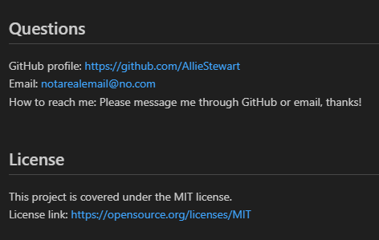

# README-Generator

## Description
Challenge 9 coursework for UT bootcamp. Uses Node.js.  
This is a README generator, meant to create a professional-looking  
README file from a user's input on the command-line.  

## Screenshots
---Using the terminal---  

---Seeing the new README output---  

---The README preview---  
  

## Usage
Simply click on the video and watch the magic happen.  
Watch the video here: https://drive.google.com/file/d/1rZP_EsrgQPjNKGnYOO0pbme8BJjBmpez/view  

## What I Have Learned
I have learned how to properly utilize node.js in regards to file creation,  
sharing information between JavaScript files, and object destructuring.  

## Credits
Made by Allie Stewart.  
Some helpful info from my class notes, https://stackoverflow.com and:   
https://gist.github.com/lukas-h/2a5d00690736b4c3a7ba for list of license badges.

## Licenses
Please refer to the LICENSE in the repository.  